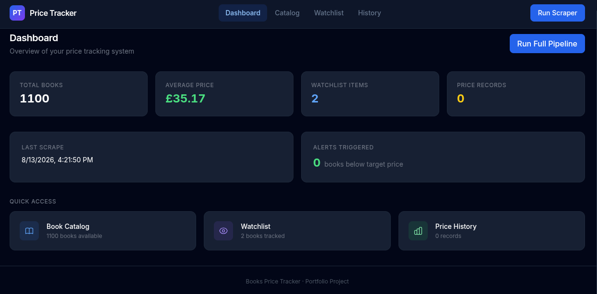
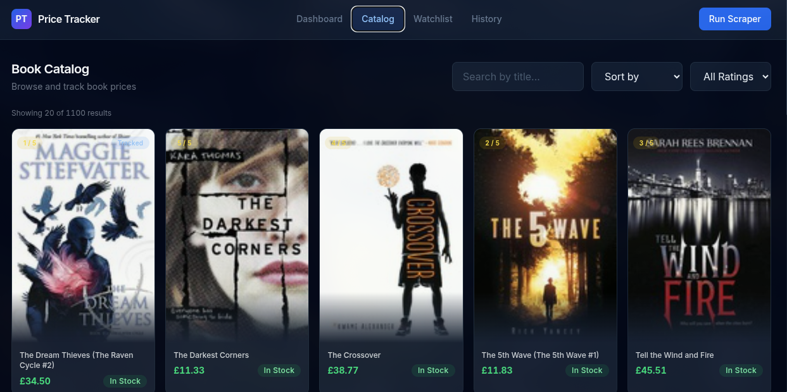
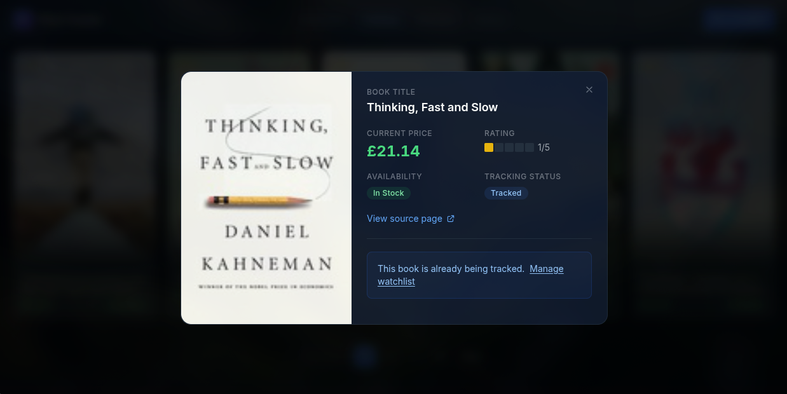
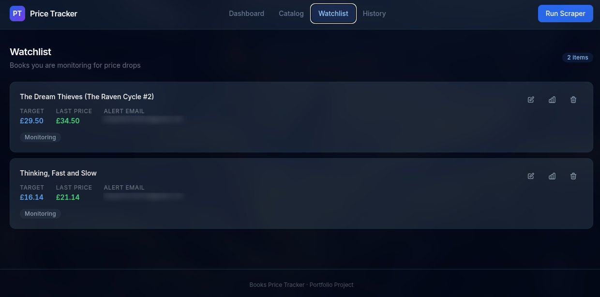
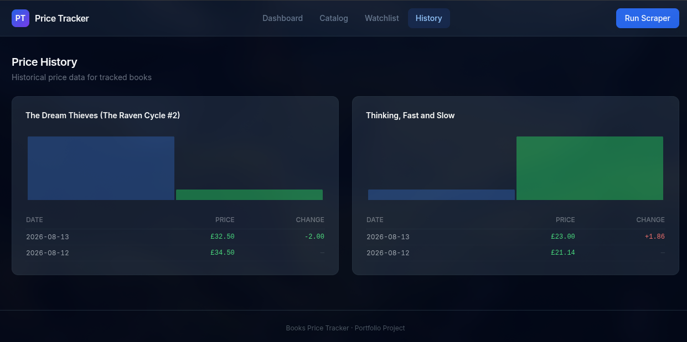

# Books Price Tracker

A full-stack price monitoring system that automatically tracks book prices, detects price drops, and delivers email alerts.

Built to demonstrate practical skills in backend engineering, web scraping, REST API design, concurrency, data persistence, task scheduling, and modern frontend development.

---

## Overview

**Books Price Tracker** is a portfolio project designed to solve a simple problem: monitoring online book prices without having to check them manually every day.

The system scrapes a live book catalog, stores historical prices, compares them against user-defined target prices, and sends formatted email alerts when a tracked book reaches the configured target.

The complete pipeline can run automatically on a daily schedule.

---

## Live Demo

> **API Documentation:** `http://localhost:8000/api/docs`
> **Frontend:** `http://localhost:5173`

> These URLs refer to a local development environment.

---

## What This Project Demonstrates

| Skill                        | Implementation                                                              |
| ---------------------------- | --------------------------------------------------------------------------- |
| **Web Scraping**             | Concurrent scraper using `ThreadPoolExecutor` and `BeautifulSoup4`          |
| **Concurrency**              | Producer-consumer pattern with thread-safe queues                           |
| **REST API Design**          | CRUD API with FastAPI, Pydantic validation, CORS, and OpenAPI documentation |
| **Frontend Development**     | Reactive SPA built with Vue 3 Composition API                               |
| **State Management**         | Centralized state management with Pinia                                     |
| **Client-side Routing**      | Vue Router                                                                  |
| **Data Persistence**         | Structured JSON and CSV storage                                             |
| **Email Delivery**           | HTML email templates via SMTP with plaintext fallback                       |
| **Task Scheduling**          | Automated daily pipeline using the `schedule` library                       |
| **Configuration Management** | Environment-based configuration with `python-dotenv`                        |
| **UI/UX**                    | Responsive dark-theme interface with Tailwind CSS                           |

---

## Features

* **Book Catalog** — Searchable, filterable, and paginated catalog with cover images, ratings, stock status, and direct links to source pages.
* **Watchlist** — Add books with a target price and email address, and update or remove entries at any time.
* **Price History** — Records every scraped price and displays historical changes through a visual chart and change log.
* **Price Drop Detection** — Compares the current price with the previous recorded price and the user's target price.
* **Email Alerts** — Sends formatted HTML emails containing the current price, previous price, target price, and recent price history.
* **Dashboard** — Centralized view with system statistics, quick navigation, and a one-click full pipeline trigger.
* **Daily Scheduler** — Runs the complete monitoring pipeline automatically at a configured time.

---

## Architecture

```text
┌─────────────────────────────────────┐
│           Vue 3 Frontend            │
│   Pinia · Vue Router · Tailwind     │
└──────────────────┬──────────────────┘
                   │
              HTTP / REST
                   │
┌──────────────────▼──────────────────┐
│          FastAPI Backend            │
│       REST API · OpenAPI Docs       │
└──────────┬────────────────┬─────────┘
           │                │
     ┌─────▼─────┐    ┌────▼──────────────┐
     │  Scraper  │    │   Business Logic  │
     │ ThreadPool │    │   Price Monitor   │
     │            │    │   Email Alerts    │
     │            │    │   Scheduler       │
     └─────┬──────┘    └────┬──────────────┘
           │                │
           └────────┬───────┘
                    │
        ┌───────────▼──────────────────┐
        │          Data Layer          │
        │ books.csv · watchlist.json   │
        │      price_history.json      │
        └──────────────────────────────┘
```

---

## Technology Stack

### Backend

| Technology         | Purpose                                     |
| ------------------ | ------------------------------------------- |
| Python 3.10+       | Core programming language                   |
| FastAPI            | REST API framework                          |
| Pydantic           | Data validation                             |
| BeautifulSoup4     | HTML parsing                                |
| Requests           | HTTP client                                 |
| ThreadPoolExecutor | Concurrent scraping                         |
| `queue`            | Thread-safe producer-consumer communication |
| `schedule`         | Task scheduling                             |
| `smtplib`          | Email delivery                              |
| `python-dotenv`    | Environment configuration                   |

### Frontend

| Technology   | Purpose                           |
| ------------ | --------------------------------- |
| Vue 3        | UI framework with Composition API |
| Pinia        | State management                  |
| Vue Router   | Client-side routing               |
| Tailwind CSS | Utility-first styling             |
| Axios        | HTTP client                       |
| Vite         | Build tool and development server |

---

## Project Structure

```text
books-price-tracker/
│
├── .env.example              # Environment variable template
├── .gitignore
├── README.md
├── requirements.txt
│
├── books/
│   └── books.csv             # Scraped catalog (generated)
│
├── data/
│   ├── watchlist.json        # User watchlist (generated)
│   └── price_history.json    # Price records (generated)
│
├── src/
│   ├── config.py             # Centralized paths and environment config
│   ├── main.py               # CLI entry point
│   ├── api.py                # FastAPI application and endpoints
│   ├── scraper.py            # Concurrent scraper
│   ├── tracker_setup.py      # Watchlist management
│   ├── price_history.py      # Price history storage
│   ├── price_monitor.py      # Price drop detection logic
│   ├── email_alert.py        # Email notification service
│   └── scheduler.py           # Daily pipeline automation
│
└── frontend/
    ├── package.json
    ├── vite.config.js
    ├── tailwind.config.js
    │
    └── src/
        ├── App.vue
        ├── main.js
        ├── style.css
        │
        ├── api/
        │   └── ...            # Axios API client
        │
        ├── components/
        │   ├── Navbar.vue
        │   ├── BookCard.vue
        │   ├── BookModal.vue
        │   ├── WatchlistItem.vue
        │   ├── PriceChart.vue
        │   ├── StatusBadge.vue
        │   └── Toast.vue
        │
        ├── views/
        │   ├── DashboardView.vue
        │   ├── BooksView.vue
        │   ├── WatchlistView.vue
        │   └── HistoryView.vue
        │
        ├── stores/
        │   ├── books.js
        │   ├── watchlist.js
        │   └── toast.js
        │
        └── router/
            └── index.js
```

---

## Getting Started

### Prerequisites

Make sure you have the following installed:

* Python 3.10 or higher
* Node.js 18 or higher
* npm
* A Gmail account with App Passwords enabled if you want to use email alerts

### 1. Clone the Repository

```bash
git clone https://github.com/Dipss4/Scraper-Books-Price-Tracker.git
cd Scraper-Books-Price-Tracker
```

### 2. Backend Setup

Create and activate a Python virtual environment:

```bash
python -m venv venv
```

Linux / macOS:

```bash
source venv/bin/activate
```

Windows:

```powershell
venv\Scripts\activate
```

Install the dependencies:

```bash
pip install -r requirements.txt
```

Create your environment file:

```bash
cp .env.example .env
```

On Windows, you can copy the file manually or use:

```powershell
copy .env.example .env
```

Edit `.env` with your configuration:

```env
SMTP_SERVER=smtp.gmail.com
SMTP_PORT=587

SENDER_EMAIL=your_email@gmail.com
SENDER_PASS=your_app_password

DAILY_RUN_TIME=09:00
MAX_WORKERS=10

API_HOST=0.0.0.0
API_PORT=8000
```

### 3. Frontend Setup

Install the frontend dependencies:

```bash
cd frontend
npm install
cd ..
```

### 4. Run the Application

Start the API server:

```bash
cd src
python api.py
```

The API will be available at:

```text
http://localhost:8000
```

Interactive API documentation:

```text
http://localhost:8000/api/docs
```

In a second terminal, start the frontend:

```bash
cd frontend
npm run dev
```

The frontend will be available at:

```text
http://localhost:5173
```

---

## Usage

### Typical Workflow

1. Open the web interface.
2. Click **Run Scraper** in the navbar to populate the book catalog.
3. Browse the catalog and open a book.
4. Set a target price and email address, then add the book to your watchlist.
5. Click **Run Full Pipeline** on the dashboard.
6. The pipeline scrapes the catalog, checks tracked books for price changes, and sends alerts when conditions are met.
7. Optionally start the daily scheduler for automated monitoring.

---

## API Endpoints

| Method   | Endpoint                 | Description                                                         |
| -------- | ------------------------ | ------------------------------------------------------------------- |
| `GET`    | `/api/books`             | List books with search, sort, rating, pagination, and limit options |
| `GET`    | `/api/books/{id}`        | Get a single book by ID                                             |
| `GET`    | `/api/watchlist`         | List all watchlist entries                                          |
| `POST`   | `/api/watchlist`         | Add a book to the watchlist                                         |
| `PUT`    | `/api/watchlist/{index}` | Update target price or email                                        |
| `DELETE` | `/api/watchlist/{index}` | Remove a watchlist entry                                            |
| `GET`    | `/api/history`           | Get all price history                                               |
| `GET`    | `/api/history/{title}`   | Get price history for a specific book                               |
| `POST`   | `/api/scrape`            | Trigger a background scrape                                         |
| `GET`    | `/api/scrape/status`     | Check scraper status                                                |
| `POST`   | `/api/pipeline`          | Run the full monitoring pipeline                                    |
| `GET`    | `/api/stats`             | Get dashboard statistics                                            |

Interactive API documentation is available through FastAPI's OpenAPI interface at:

```text
http://localhost:8000/api/docs
```

---

## Email Alerts

When a tracked book reaches the configured target price and a price drop is detected, the system sends an HTML email containing:

* Book title
* Current price
* Previous price
* Percentage saved
* Configured target price
* Recent price history
* Price history table with the last 10 recorded prices

If SMTP credentials are not configured, notifications are logged to the console and `tracker.log` instead.

---

## Gmail Setup

To use Gmail for email alerts:

1. Enable two-step verification on your Google account.
2. Open Google's App Passwords settings.
3. Create an app password for the application.
4. Use the generated password as `SENDER_PASS` in `.env`.

For security, never commit your `.env` file or expose your SMTP credentials in the repository.

---

## Environment Variables

| Variable         | Default          | Description                          |
| ---------------- | ---------------- | ------------------------------------ |
| `SMTP_SERVER`    | `smtp.gmail.com` | SMTP server hostname                 |
| `SMTP_PORT`      | `587`            | SMTP port used for TLS               |
| `SENDER_EMAIL`   | —                | Email address used to send alerts    |
| `SENDER_PASS`    | —                | SMTP application password            |
| `DAILY_RUN_TIME` | `09:00`          | Time when the scheduler runs daily   |
| `MAX_WORKERS`    | `10`             | Number of concurrent scraper threads |
| `API_HOST`       | `0.0.0.0`        | API server bind address              |
| `API_PORT`       | `8000`           | API server port                      |

---

## Scraper Design

The scraper follows a producer-consumer architecture.

The producer side uses a `ThreadPoolExecutor` to fetch and parse multiple book pages concurrently. Each worker extracts:

* Book title
* Price
* Rating
* Stock status
* Cover image URL
* Book URL

Scraped results are passed through a thread-safe queue to a dedicated consumer responsible for file I/O.

This separates network-bound scraping work from disk writes and prevents multiple worker threads from writing to the same file simultaneously.

The scraper continues processing pages until it receives a non-successful response indicating that the catalog has ended.

### Why This Architecture?

Web scraping is primarily I/O-bound. Using multiple threads allows the application to overlap network requests instead of waiting for each request to complete sequentially.

The producer-consumer pattern also provides a clear separation between:

```text
Network I/O
    ↓
Concurrent Workers
    ↓
Thread-Safe Queue
    ↓
Single Consumer
    ↓
File I/O
```

---

## Screenshots

Screenshots can be added here after running the project locally.

Suggested screenshots:

## Screenshots

### Dashboard


### Book Catalog


### Book Detail


### Watchlist


### Price History


---

## Roadmap

Possible future improvements:

* [ ] Replace flat-file storage with PostgreSQL or SQLite
* [ ] Add user authentication and multi-user support
* [ ] Support additional book sources
* [ ] Add configurable percentage-based price drop thresholds
* [ ] Add browser push notifications
* [ ] Add Docker Compose support for one-command deployment
* [ ] Add unit and integration test coverage
* [ ] Add structured logging
* [ ] Add automated CI/CD
* [ ] Add deployment documentation

---

## Author

Open to freelance projects and collaborations.

GitHub: **[github.com/Dipss4](https://github.com/Dipss4)**

📧 **Email**: [dipss.git@gmail.com](mailto:dipss.git@gmail.com)

💼 **LinkedIn**: [Luís Martins](https://www.linkedin.com/in/lu%C3%ADs-martins-589607316/)

---

## Learning Resources

This project is built around concepts documented in the official documentation of the technologies used.

Recommended resources for studying the concepts behind this project:

* **FastAPI** — REST APIs, dependency injection, validation, and OpenAPI
* **Python Documentation** — threading, queues, HTTP, files, and standard-library modules
* **Beautiful Soup Documentation** — HTML parsing and web scraping
* **Vue.js Documentation** — Composition API and reactive frontend development
* **Pinia Documentation** — frontend state management
* **Tailwind CSS Documentation** — utility-first CSS
* **Vite Documentation** — frontend tooling and development servers
* **MDN Web Docs** — HTTP, REST concepts, HTML, CSS, and JavaScript
* **Python `concurrent.futures` Documentation** — thread pools and concurrent execution

For deeper study, useful books include *Fluent Python* by Luciano Ramalho for advanced Python concepts and *Designing Data-Intensive Applications* by Martin Kleppmann for broader software architecture, data storage, concurrency, and distributed-system concepts.
